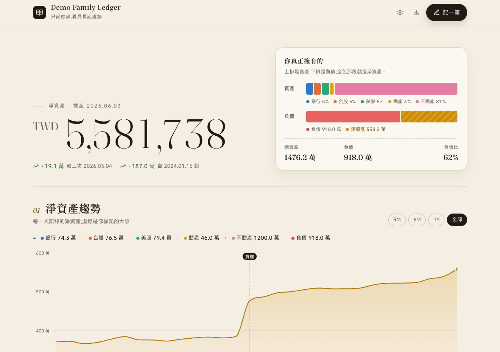

# wealth

**只記餘額的家庭資產帳本。** 不記每一筆消費,只在想到的時候更新每個帳戶的餘額,就能看到淨資產的長期趨勢、資產組成、資產負債表和房貸月付變化。

*A net-worth ledger for people who don't want to track every transaction: record account balances now and then, see the long-term trend. Go + Gin, runs as a single binary with SQLite, or on Cloudflare Workers with D1.*



## 功能

- **只記餘額**:銀行、台股、美股、動產、不動產、加密貨幣、負債。沒更新的帳戶自動沿用上一筆。
- **多幣別**:外幣帳戶每筆紀錄存當天匯率,「記一筆」時自動帶入([fawazahmed0/currency-api](https://github.com/fawazahmed0/exchange-api),免金鑰,2024-03 起有每日歷史)。基準幣別可設定。
- **趨勢與組成**:淨資產曲線(可拖曳放大一段期間)、各類資產堆疊圖(可複選篩選)、資產負債表(資產 = 負債 + 淨資產)。
- **大事記**:買房、換工作這類事件,會在趨勢圖上畫一條虛線。
- **房貸**:每段貸款填本金、利率、撥款日、寬限期、總期數,算出這個月要繳多少、寬限期何時結束、月付何時會跳、何時繳清。
- **全部可改**:帳本名稱、帳戶(名稱/類別/過去每筆餘額)、貸款、事件都能編輯或刪除。
- **匯出**:CSV(帳戶一列、日期一欄,Excel 直接開);自架版另有完整 `.db` 下載與每日自動備份。

## 自架(單一執行檔 + SQLite)

需要 Go 1.25+。

```sh
go run .                                        # http://127.0.0.1:8080,資料在 ./wealth.db
WEALTH_PASS=secret WEALTH_ADDR=:8080 go run .   # 對外開放時必須設密碼(basic auth)
go test ./...
```

| 環境變數 | 預設 | 說明 |
|---|---|---|
| `WEALTH_DB` | `wealth.db` | SQLite 檔案 |
| `WEALTH_ADDR` | `127.0.0.1:8080` | 監聽位址;非本機位址時一定要設 `WEALTH_PASS` |
| `WEALTH_USER` / `WEALTH_PASS` | `me` / 空 | basic auth |
| `WEALTH_BACKUP_DIR` | `backups` | 每天自動備份一份,保留最近 30 份 |

備份請用 SQLite 的線上備份,不要直接 `cp`(WAL 模式下資料可能還在 `-wal` 檔裡):

```sh
sqlite3 wealth.db ".backup wealth-$(date +%F).db"
```

## 部署到 Cloudflare Workers(D1 + Access)

同一份 Go 程式編成 WebAssembly 跑在 Workers 上([syumai/workers-go](https://github.com/syumai/workers-go)),資料存 D1。

1. `npx wrangler d1 create wealth`,把 `wrangler.jsonc` 複製成 `wrangler.local.jsonc`,填入 database id 和網域。
2. 在 Cloudflare Zero Trust 建一個 Access application 保護這個網域,把團隊網域和 AUD tag 填進 `vars`。
   **Worker 會驗證 Access 的 JWT;沒設定時會拒絕服務**(除非你明確設 `ALLOW_PUBLIC=1`)。
3. `make deploy-worker`(套用 migration 並部署)。

注意:wasm 壓縮後約 6.6 MB,超過 Workers 免費方案的 3 MB 上限,需要 Workers Paid。D1 內建 30 天 Time Travel,可還原到任一時間點。

## 結構

| 檔案 | 內容 |
|---|---|
| `app.go` | 所有頁面與 API 路由(兩種部署共用) |
| `server.go` | 自架入口:SQLite、gzip、basic auth、每日備份 |
| `worker.go` | Workers 入口:D1、Access 驗證 |
| `loan.go` | 寬限期只繳息 → 本息平均攤還的月付與餘額計算 |
| `access.go` | Cloudflare Access JWT 驗證 |
| `export.go` | CSV 匯出 |
| `migrations/` | 資料表(兩種部署共用) |
| `web/index.html` | 前端(單一檔案,Chart.js 捲到圖表時才載入) |
| `web/icons.js` | 用到的 [lucide](https://lucide.dev) 圖示子集,`web/mkicons.cjs` 產生 |

## License

MIT
