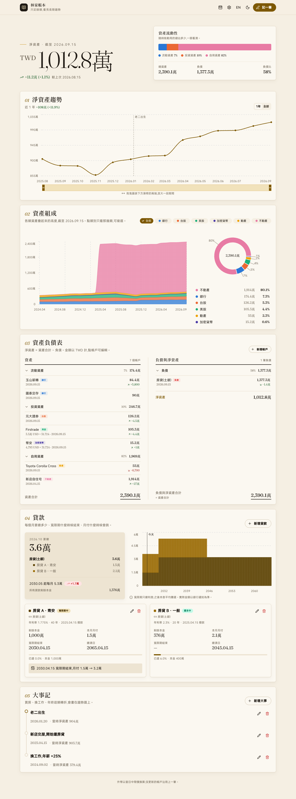

<div align="center">
  
  <h1>wealth</h1>
  <p><b>只記餘額的家庭資產帳本</b><br>不記每一筆消費,想到時更新帳戶餘額,就看得到淨資產的長期趨勢。</p>
</div>

<p align="center">
  <a href="https://github.com/SammyLin/wealth/actions/workflows/test.yml"></a>
  <a href="../LICENSE"></a>
  <a href="../go.mod"></a>
  <a href="#部署到-cloudflare-workers"></a>
  <a href="#自架"></a>
</p>

<p align="center">
  <a href="../README.md">English</a> | 繁體中文
</p>



## 為什麼

記帳 App 大多要你記下每一筆消費。持續記半年的人不多,而真正想知道的通常只是:**我們家的錢,這幾年是變多還是變少?**

wealth 只做這件事。每個帳戶(銀行、證券、房子、房貸)偶爾記一次餘額,其餘交給它:

- **沒更新的帳戶自動沿用上一筆**,不會因為少記一個帳戶,淨資產就像掉下去。
- **外幣照當天匯率換算**,自動抓匯率,美股不會被匯率記成一團亂。
- **大事會畫在圖上**:買房、換工作這類轉折,回頭看曲線時一眼對得上。
- **房貸看得到未來**:寬限期何時結束、月付哪個月會跳、何時繳清。

## 功能

| | |
|---|---|
| **淨資產趨勢** | 曲線按實際日期排,不均勻的記錄間隔不會被拉平;可用滑鼠或鍵盤放大某段期間 |
| **變動原因** | 總覽列出上次以來是哪幾類資產讓淨資產變動,並提醒超過 90 天沒更新的帳戶 |
| **自訂結構** | 帳戶類別自己定:名稱、顏色、流動性(流動/投資/自用/負債);帳戶可排序、加備註 |
| **快速輸入** | 一張表填完所有帳戶:Tab 或 Enter 往下,可輸入 `1,234,567`、`12.5萬`,可貼上試算表的一整欄,也能補記過去的日期 |
| **資產組成** | 各類資產堆疊圖,可複選只看幾類 |
| **資產負債表** | 資產依流動性分組 = 負債 + 淨資產,兩邊合計相等 |
| **房貸** | 本金、利率、撥款日、寬限期、期數 → 每月月付、月付變化、繳清日 |
| **多幣別** | 每筆紀錄存當天匯率,「記一筆」自動帶入;基準幣別可設定 |
| **全部可改** | 帳本名稱、帳戶、過去每筆餘額、貸款、大事都能編輯或刪除 |
| **自訂版面** | 首頁區塊可排序、隱藏;淺色/深色/跟隨系統 |
| **中英雙語** | 介面跟著瀏覽器語言,右上角隨時切換 |
| **匯入與匯出** | 從 CSV 匯入餘額;匯出試算表 CSV,或可以直接匯回來的明細 CSV;自架版另有完整 `.db` 下載與每日自動備份 |

## 快速開始

**Docker**(不用另外裝任何東西):

```sh
git clone https://github.com/SammyLin/wealth.git
cd wealth
cp .env.example .env          # 設定 WEALTH_PASS
docker compose up -d          # http://127.0.0.1:8080,帳號 me
```

**從原始碼**需要 Go 1.26+ 和 Node 20+(前端是 Vite 專案,建置後編進 Go 執行檔):

```sh
git clone https://github.com/SammyLin/wealth.git
cd wealth
make run                      # 建置 web/,再開 http://127.0.0.1:8080,資料存在 ./wealth.db
make seed                     # 選用,在另一個終端機跑:塞一份示範資料
```

剛 clone 下來直接 `go run ./cmd/wealth` 也能跑(API 正常,首頁會說明怎麼建置前端)。

**開發流程:** `go run ./cmd/wealth`(API 在 :8080)加 `cd web && npm run dev`(Vite 熱更新在 :5173,`/api` 會代理過去),或直接 `make dev`。

接著:

1. 第一個畫面先選**基準幣別**和**金額單位**(記下第一筆餘額後基準幣別就不能改)
2. **新增帳戶**:名稱、類別(銀行/台股/美股/加密貨幣/動產/不動產/負債,或自己新增)、幣別
3. **記一筆**:填各帳戶目前餘額,外幣匯率自動帶入
4. 之後每隔一陣子再「記一筆」,改有變動的帳戶就好

## 自架

單一執行檔 + SQLite,資料存在本機檔案;或用 Docker(資料在 `wealth-data` volume,`WEALTH_PASS` 從 `.env` 讀):

```sh
cp .env.example .env && $EDITOR .env   # 設定 WEALTH_PASS
docker compose up -d                  # 第一次會先建置映像檔
```

```sh
WEALTH_PASS=secret WEALTH_ADDR=:8080 ./wealth   # 對外開放時必須設密碼(basic auth)
```

| 環境變數 | 預設 | 說明 |
|---|---|---|
| `WEALTH_DB` | `wealth.db` | SQLite 檔案 |
| `WEALTH_ADDR` | `127.0.0.1:8080` | 監聽位址;不是本機位址時一定要設 `WEALTH_PASS` |
| `WEALTH_USER` / `WEALTH_PASS` | `me` / 空 | basic auth |
| `WEALTH_HOSTS` | 空 | 沒設密碼時只接受 `localhost`/`127.0.0.1` 這些主機名稱(防 DNS rebinding);其他名稱用逗號列在這裡 |
| `WEALTH_BACKUP_DIR` | `backups` | 每天自動備份一份,保留最近 30 份 |

**改用掛載資料夾而不是 volume:** 容器以 uid 10001 執行,資料夾要讓它寫得進去:`mkdir data && sudo chown 10001 data`,再把 `compose.yaml` 改成 `- ./data:/data`。

**放在反向代理後面:** 瀏覽器送來的 `Origin` 和伺服器看到的主機不同時會拒絕寫入,所以代理要把原本的主機轉送過來。nginx 的 `proxy_pass` 預設送的是上游位址,請加 `proxy_set_header Host $host;`(或 `X-Forwarded-Host`,伺服器也認)。Caddy(`reverse_proxy 127.0.0.1:8080`)和 Traefik 預設就會保留主機。

`GET /healthz` 不需要帳密,回 `ok`,給容器健康檢查用。

備份請用 SQLite 的線上備份,不要直接 `cp`(WAL 模式下資料可能還在 `-wal` 檔裡):

```sh
sqlite3 wealth.db ".backup wealth-$(date +%F).db"
```

## 部署到 Cloudflare Workers

同一份 Go 程式編成 WebAssembly 跑在 Workers 上([syumai/workers-go](https://github.com/syumai/workers-go)),資料存 D1。

1. `npx wrangler d1 create wealth`,把 `wrangler.jsonc` 複製成 `wrangler.local.jsonc`,填入 database id 和網域。
2. 在 Cloudflare Zero Trust 建一個 Access application 保護這個網域,把團隊網域和 AUD tag 填進 `vars`。
   **Worker 會驗證 Access 的 JWT;沒設定時會拒絕服務**(除非明確設 `ALLOW_PUBLIC=1`)。
3. `make deploy-worker`(套用 migration 並部署)。

> wasm 壓縮後約 6.6 MB,超過 Workers 免費方案的 3 MB 上限,需要 Workers Paid。D1 內建 30 天 Time Travel,可還原到任一時間點。

## 架構

| 檔案 | 內容 |
|---|---|
| `cmd/wealth/server.go` | 自架入口:SQLite、gzip、basic auth |
| `cmd/wealth/worker.go` | Workers 入口:D1、Access 驗證 |
| `internal/ledger/router.go` | 所有 API 路由與寫入防護(兩種部署共用) |
| `internal/ledger/import.go` | CSV 餘額匯入 |
| `internal/ledger/model.go` | 資料型別、各日期淨值序列、輸入檢查 |
| `internal/ledger/store.go` | 設定與貸款的資料庫讀取 |
| `internal/ledger/fx.go` | 匯率查詢 |
| `internal/ledger/loan.go` | 寬限期只繳息 → 本息平均攤還的月付與餘額計算 |
| `internal/ledger/access.go` | Cloudflare Access JWT 驗證 |
| `internal/ledger/export.go` | CSV 匯出(試算表格式,以及匯入讀得懂的明細格式) |
| `internal/ledger/backup.go` | 自架版的 .db 下載與每日備份 |
| `internal/ledger/spa.go` | 把編進去的 `web/dist` 當單頁應用提供(雜湊檔名資產長期快取,其餘路徑回 `index.html`) |
| `embed.go` | 把 `web/dist` 和 `migrations/` 編進執行檔 |
| `migrations/` | 資料表(兩種部署共用);`0002_kinds_layout.sql` 加入自訂類別、帳戶排序與備註 |
| `web/` | 前端:Vite + React + TypeScript + [Mantine](https://mantine.dev),`web/src/features/` 下一個功能一個資料夾(見 [web/README.md](../web/README.md)) |
| `Dockerfile`、`compose.yaml` | 自架映像檔(Node 建置 → Go 建置 → 精簡 Alpine 執行) |

## 參與

歡迎 issue 和 PR,開發方式見 [CONTRIBUTING.md](../CONTRIBUTING.md)。

## License

[MIT](../LICENSE)
